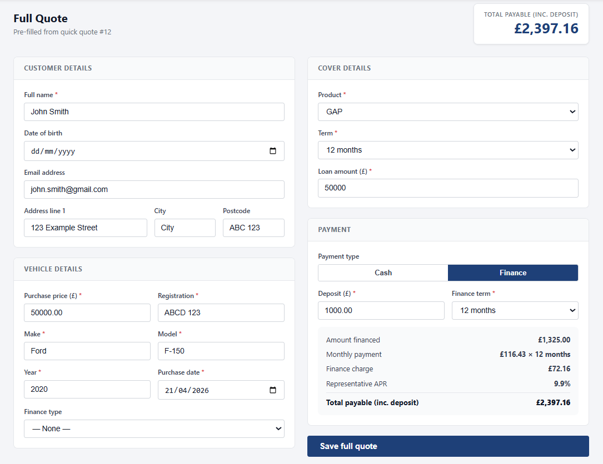
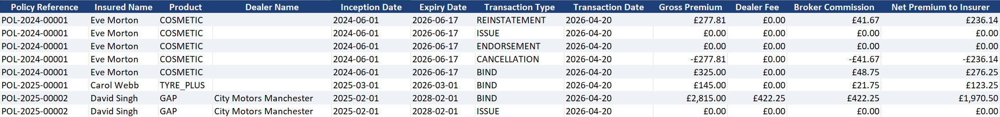

<div align="center">

# Insurance Platform
### Multi-tenant motor ancillary insurance — quote to policy in minutes

**A production-grade SaaS platform handling the full policy lifecycle across isolated broker tenants**

[](https://github.com/tomadams2909/insurance_platform/actions/workflows/ci.yml)


[What it is](#what-it-is) · [Live Demo](#live-demo) · [Architecture](#architecture) · [Stack](#stack) · [Getting Started](#getting-started) · [Features](#features) · [Testing](#testing)

</div>

---

## What it is

A multi-tenant motor ancillary insurance platform that handles the complete policy lifecycle — from quick quote to document generation — across fully isolated broker tenants. Each tenant gets white-label branding, its own product access controls, and a dedicated dealer commission engine.

```
Quick Quote    →  two fields, instant indicative price, promotable to a full quote
Full Quote     →  complete customer and vehicle data, live pricing, optional finance
Bind & Issue   →  state-machine transitions, e-signature step, branded PDF schedule
Endorse / Cancel / Reinstate  →  full audit trail, pro-rata refund logic
BDX Export     →  FCA-compliant Excel report across any date range
```

Products: **GAP · Tyre Essential · Tyre Plus · Cosmetic · VRI · Total Loss Protect**

---

## Live Demo

**[insuranceplatform-production.up.railway.app](https://insuranceplatform-production.up.railway.app)**

Three independently branded tenants demonstrate the multi-tenant SaaS model. All accounts share the password `Demo1234!`.

| Tenant | Email | Role |
|---|---|---|
| Insurance Co. Ltd *(navy / gold)* | admin@insuranceco.com | Tenant Admin |
| Insurance Co. Ltd | broker@insuranceco.com | Broker |
| Insurance Co. Ltd | citybroker@insuranceco.com | Broker (City Motors Manchester) |
| Car Cover Ltd *(emerald / mint)* | admin@carcover.com | Tenant Admin |
| Car Cover Ltd | broker@carcover.com | Broker |
| Auto Insurance Ltd *(burgundy / gold)* | admin@autoinsurance.com | Tenant Admin |

---

## Screenshots

### Quote flow — full quote form with pricing information


### Policy detail — state transitions and document downloads


### White-label branding — three tenants, three identities
| Insurance Co. Ltd | Car Cover Ltd | Auto Insurance Ltd |
|---|---|---|
|  |  |  |

### Policy document


### BDX Report


---

## Architecture

```
────────────────────────────────────────────────────
              React 19 Frontend (Vite)
         Login · Quotes · Policies · Dealers · Reports
─────────────────────┬──────────────────────────────
                     │ HTTP / JWT
─────────────────────▼──────────────────────────────
              FastAPI Backend (uvicorn)
  /auth  /quotes  /policies  /dealers  /reports  /internal
────────┬──────────────┬──────────────────┬──────────
        │              │                  │
────────▼──────  ──────▼──────  ──────────▼────────
│  Pricing &  │  │  Policy    │  │  Document       │
│  Commission │  │  State     │  │  Generation     │
│  Engine     │  │  Machine   │  │  (fpdf2 PDFs)   │
─────────────── ─────────────── ──────────────────
                     │
─────────────────────▼──────────────────────────────
              PostgreSQL 17 (SQLAlchemy ORM)
              Alembic migrations · Tenant-scoped queries
────────────────────────────────────────────────────
```

**Tenant isolation** — every ORM query is scoped to `tenant_id` derived from the authenticated user. Cross-tenant data access is structurally impossible at the database layer.

**Policy state machine** — `ALLOWED_TRANSITIONS` maps `(current_status, action) → new_status`. Invalid transitions are rejected with HTTP 422 before any data is written. Every transition is appended to an immutable audit log with user, timestamp, and financial delta.

**Commission resolution** — product-specific rate → dealer default → zero. Rates are locked at bind and never change during the policy term, satisfying FCA disclosure requirements.

**Document generation** — fpdf2 generators produce tenant-branded PDFs for every lifecycle event. Tenant primary colour and logo are applied at render time; no static templates are stored per tenant.

---

## Stack

| Layer | Technology |
|---|---|
| Backend | FastAPI 0.111 · uvicorn |
| Database | PostgreSQL 17 |
| ORM | SQLAlchemy 2.0 |
| Migrations | Alembic |
| Auth | JWT (python-jose) · bcrypt (passlib) |
| PDF generation | fpdf2 |
| Excel export | openpyxl |
| Frontend | React 19 · Vite · React Router 7 |
| HTTP client | Axios |
| Testing | pytest · httpx |
| Linting | flake8 |
| CI | GitHub Actions |
| Deployment | Docker Compose · Railway.app |

---

## Getting Started

### Prerequisites

- [Docker Desktop](https://www.docker.com/products/docker-desktop/) — recommended, everything else is handled
- Or: Python 3.11+ and Node 20+ for manual setup

### Docker (recommended)

```bash
git clone https://github.com/tomadams2909/insurance_platform.git
cd insurance_platform
docker compose up --build
```

First build takes 3–5 minutes (subsequent starts are fast — layers are cached). Docker automatically:

1. Starts PostgreSQL and waits for the health check
2. Runs all Alembic migrations
3. Seeds three demo tenants with dealers, users, and sample policies
4. Starts the FastAPI backend and React frontend

```bash
cp .env.example .env
# SECRET_KEY, POSTGRES_* and VITE_API_URL can be overridden here
```

<details>
<summary>Manual setup (without Docker)</summary>

```bash
git clone https://github.com/tomadams2909/insurance_platform.git
cd insurance_platform

# Backend
cd backend
python -m venv .venv
.venv\Scripts\activate        # Windows
# source .venv/bin/activate   # macOS / Linux
pip install -r requirements.txt
alembic upgrade head
python seed.py
uvicorn main:app --reload

# Frontend (separate terminal)
cd frontend
npm install
npm run dev
```

</details>

### Services

| Service | URL |
|---|---|
| Frontend | http://localhost:3000 |
| Backend API | http://localhost:8000 |
| Swagger UI | http://localhost:8000/docs |
| ReDoc | http://localhost:8000/redoc |

Log in with any demo account from the [Live Demo](#live-demo) table above.

---

## Features

### Policy lifecycle

Every policy moves through a strict state machine: **BOUND → ISSUED → ENDORSED / CANCELLED → REINSTATED**. Each transition is validated before any write, then appended to an immutable audit log with the acting user, timestamp, and financial delta. Invalid transitions return HTTP 422.

### Multi-tenancy and white-label branding

Each tenant has its own primary colour, logo, and favicon applied on login without a page reload. Product access and broker commission rates are configurable per tenant — a broker can only quote products their tenant has enabled. All data is isolated at the ORM layer.

### Pricing engine

Six products, each with their own rate schedule:

| Product | Pricing basis |
|---|---|
| GAP | % of loan amount × vehicle category × term |
| VRI | % of vehicle value × vehicle category × term |
| Tyre Essential | Per-wheel rate × vehicle category × term |
| Tyre Plus | Per-wheel rate × vehicle category × term |
| Cosmetic | Flat rate × vehicle category × term |
| Total Loss Protect | % of vehicle value × vehicle category × term |

Vehicle categories (1–3) are derived from purchase price. All premiums are rounded to the nearest £5.

### Dealer and commission engine

Dealers are sub-entities of a tenant. Each dealer has configurable commission rates — percentage or flat fee — with per-product overrides. FCA-mandated fee disclosure records dealer fee, broker commission, and net premium on every policy and in every generated document.

### Document generation

fpdf2 generates tenant-branded PDFs for every lifecycle event:

- **Policy Schedule** — cover details, payment breakdown, fee disclosure
- **Endorsement Certificate** — before/after snapshot of changed fields
- **Cancellation Notice** — pro-rata refund, finance non-refundability notice
- **Reinstatement Notice** — new expiry date, reinstatement premium
- **Finance Agreement** — payment schedule, total cost of credit, 14-day cooling-off notice

### Finance

Reducing-balance APR calculation at 9.9% representative APR. Validates deposit against configurable minimums, returns monthly payment and total repayable. A simulated internal endpoint (`/internal/finance/agreement`) models the third-party finance company integration point.

### BDX reporting

Date-range Excel export with all transactions: policy reference, insured, product, dealer, inception/expiry, transaction type, gross premium, dealer fee, broker commission, net premium, and cumulative premium.

### Role-based access control

| Role | Access |
|---|---|
| SUPER_ADMIN | Full cross-tenant access |
| TENANT_ADMIN | Full access within their tenant + dealer management |
| UNDERWRITER | Policy and report access |
| BROKER | Quote and bind within their tenant |
| INSURED | Read-only policy access |

---

## Testing

```bash
cd backend
pytest tests/ -v
```

156 tests across 8 files covering every layer of the platform:

| File | Coverage |
|---|---|
| test_auth.py | JWT, login, logout, role enforcement |
| test_pricing.py | Premium calculation for all six products |
| test_quotes.py | Quick quote, full quote, promotion, finance |
| test_policies.py | Bind, issue, endorse, cancel, reinstate state machine |
| test_commission.py | Dealer fee breakdown, product-specific rate overrides |
| test_finance.py | APR, monthly payment, total cost of credit |
| test_dealers.py | CRUD, commission rate management |
| test_reports.py | BDX export filtering and column mapping |

```bash
flake8 . --max-line-length=120
```

---

## Project Structure

```
insurance_platform/
├── backend/
│   ├── auth/                        # JWT, bcrypt, require_role() dependency
│   ├── models/                      # SQLAlchemy ORM models
│   ├── routers/                     # Endpoint handlers
│   ├── schemas/                     # Pydantic request/response models
│   ├── services/
│   │   ├── pricing.py               # calculate_premium() for all 6 products
│   │   ├── commission.py            # resolution chain: product → dealer → zero
│   │   ├── policy_state_machine.py  # state transitions, audit log writes
│   │   └── document.py              # fpdf2 PDF generators, tenant branding
│   ├── alembic/                     # Database migrations
│   ├── tests/                       # 156 integration tests
│   ├── main.py                      # FastAPI app entry point
│   ├── database.py                  # SQLAlchemy engine, SessionLocal
│   ├── seed.py                      # Demo tenants, dealers, users, policies
│   └── entrypoint.sh                # Migrations → seed → uvicorn
├── frontend/
│   ├── src/                         # React components and pages
│   ├── nginx.conf                   # Reverse proxy config
│   └── Dockerfile                   # Node 20 builder → nginx alpine
├── docs/screenshots/
├── docker-compose.yml
├── .github/workflows/               # CI — lint + tests on every push
└── .env.example
```

---

## License

MIT — see [LICENSE](LICENSE)

---

<div align="center">
Built with FastAPI · PostgreSQL · React · fpdf2 · Docker · Railway
</div>
