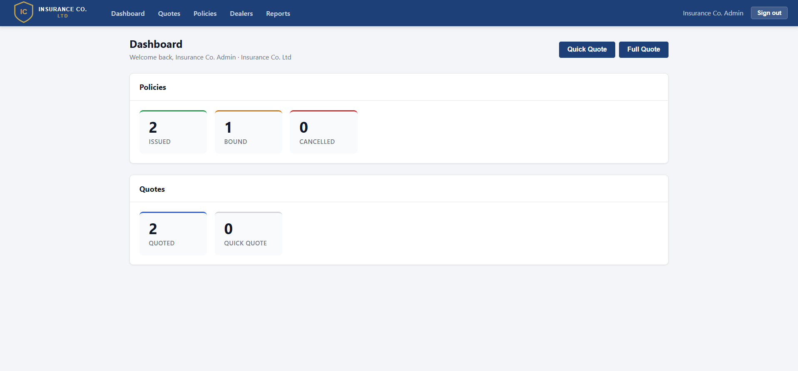
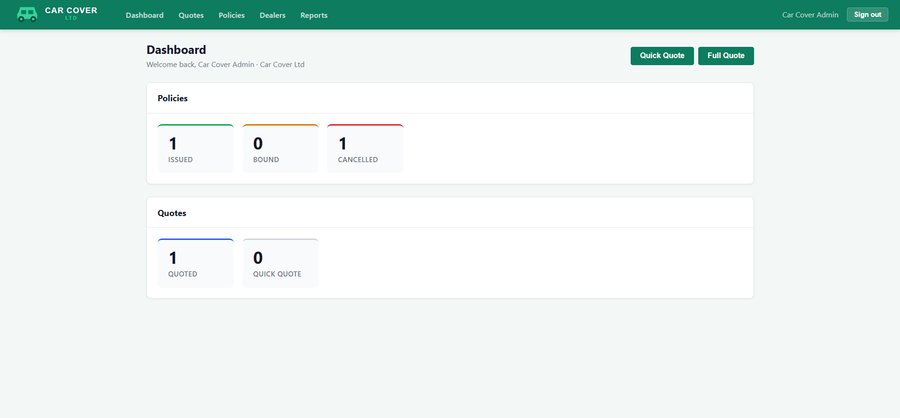
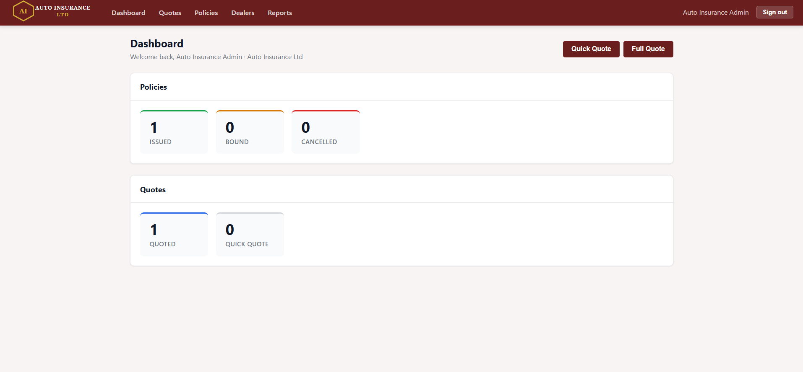
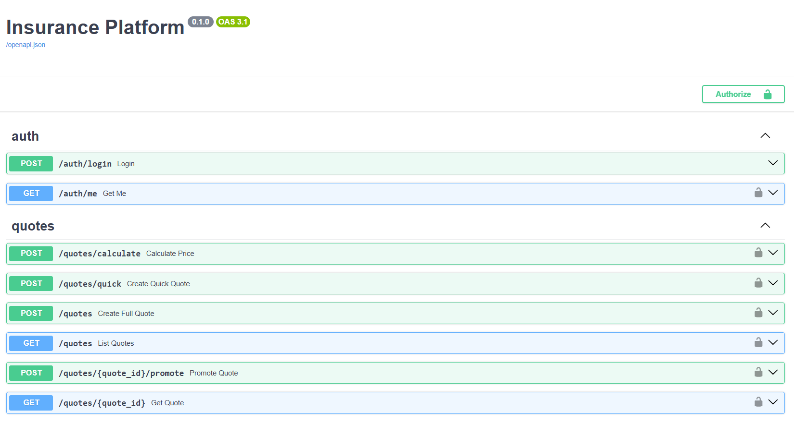
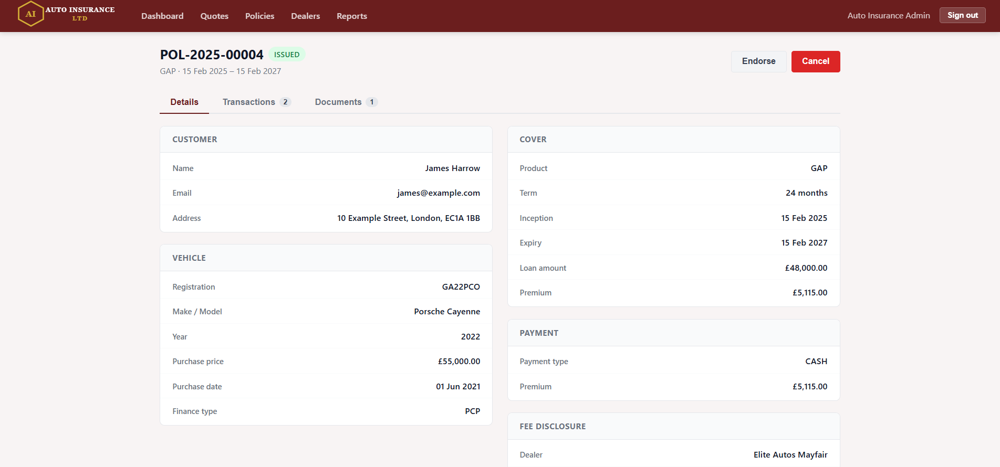
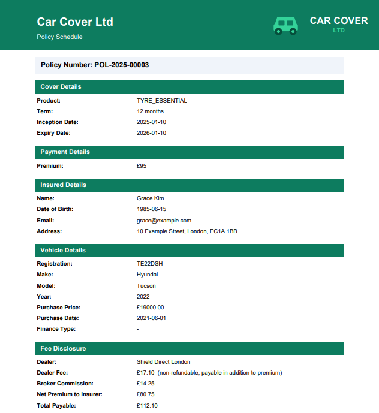
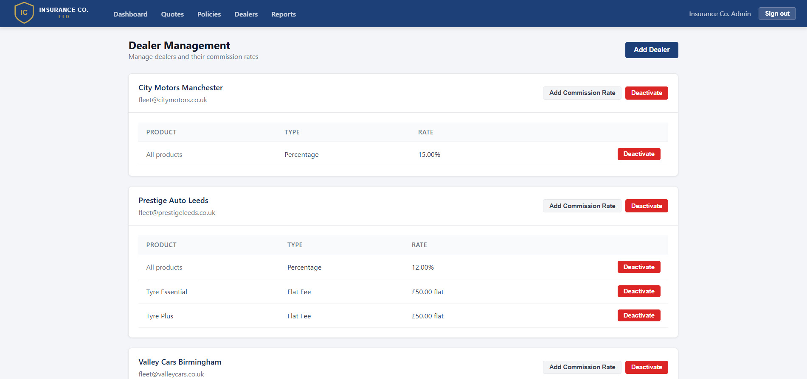

# Insurance Platform

[](https://github.com/tomadams2909/insurance_platform/actions/workflows/ci.yml)


**Live demo:** [insuranceplatform-production.up.railway.app](https://insuranceplatform-production.up.railway.app) — log in with `broker@insuranceco.com` / `Demo1234!`

A multi-tenant motor ancillary insurance platform built to production-grade standards against UK FCA motor ancillary requirements. Covers the full policy lifecycle — quote, bind, issue, endorse, cancel, reinstate — with PDF document generation, a dealer commission engine, financed payment options, and a BDX Excel report. Three independently branded demo tenants showcase the multi-tenancy model end-to-end.

| Insurance Co. Ltd | Car Cover Ltd | Auto Insurance Ltd |
|---|---|---|
|  |  |  |

---

## Architecture

```
┌─────────────────────┐     HTTP/JSON      ┌──────────────────────┐
│   React + Vite      │ ◄────────────────► │   FastAPI (Python)   │
│   frontend          │                    │   backend            │
│   localhost:5173    │                    │   localhost:8000     │
└─────────────────────┘                    └──────────┬───────────┘
                                                      │ SQLAlchemy ORM
                                                      ▼
                                           ┌──────────────────────┐
                                           │   PostgreSQL 17      │
                                           │   (Docker)           │
                                           │   localhost:5434     │
                                           └──────────────────────┘
```

**Auth flow:** Login → JWT access token (8h expiry) → Bearer token on every request → role guard enforced per endpoint.

**Tenant isolation:** Every database query is scoped to `tenant_id` derived from the authenticated user. No cross-tenant data leakage is possible at the ORM layer.

---

## Tech stack

| Layer | Technology |
|---|---|
| Backend framework | FastAPI 0.111 |
| ORM | SQLAlchemy 2.0 |
| Migrations | Alembic |
| Database | PostgreSQL 17 |
| Auth | JWT (python-jose) + bcrypt (passlib) |
| PDF generation | fpdf2 |
| Excel export | openpyxl |
| Frontend | React 19 + Vite |
| HTTP client | Axios |
| Routing | React Router 7 |
| Testing | pytest + httpx |
| Linting | flake8 |
| CI | GitHub Actions |
| Infrastructure | Docker Compose |

---

## Prerequisites

- Docker (for PostgreSQL)
- Python 3.11+
- Node 18+

---

## Setup

```bash
# 1. Clone
git clone https://github.com/tomadams2909/insurance_platform.git
cd insurance_platform

# 2. Start PostgreSQL
docker-compose up -d

# 3. Install backend dependencies
cd backend
pip install -e .

# 4. Run migrations
alembic upgrade head

# 5. Seed demo data (three tenants, dealers, sample policies)
python seed.py

# 6. Start the backend
uvicorn main:app --reload
# API available at http://localhost:8000

# 7. In a second terminal, start the frontend
cd ../frontend
npm install
npm run dev
# UI available at http://localhost:5173
```

> API documentation is auto-generated at `http://localhost:8000/docs` (Swagger UI) and `http://localhost:8000/redoc` (ReDoc). All endpoints are fully typed and documented.



---

## Features

### Quote flow
- **Quick quote** — minimal input, instant indicative price, promotable to a full quote
- **Full quote** — complete customer, vehicle, and product-specific fields
- **Live pricing** — premium recalculates as vehicle value, term, or product changes
- **Finance option** — reducing balance APR calculation (9.9% representative APR), deposit validation, monthly payment breakdown
- **Product restrictions** — tenants control which products their brokers can quote

### Policy lifecycle
- **Bind** — converts a quoted policy into a bound policy, calculates and records commission
- **Issue** — generates a branded PDF policy schedule, triggers finance agreement PDF for financed policies
- **Endorse** — amends customer details, recalculates commission delta
- **Cancel** — pro-rata refund calculation, commission clawback, cancellation notice PDF
- **Reinstate** — recalculates remaining premium, re-charges commission, reinstatement notice PDF

### Multi-tenancy
- Per-tenant branding applied dynamically: primary colour, logo, and favicon update on login with no page reload
- Per-tenant product access control
- Per-tenant broker commission rate (configurable)
- Full data isolation — a broker at Tenant A cannot see Tenant B's data

### Dealer and commission engine
- Dealers are sub-entities under a tenant (one MGA can manage 50+ dealerships)
- Per-dealer commission rates: percentage or flat fee, with per-product overrides
- Commission resolution: product-specific rate → dealer default → zero
- FCA-mandated fee disclosure: dealer fee, broker commission, and net premium to insurer recorded on every transaction and shown on the policy schedule PDF

### Document generation (fpdf2)
- Policy schedule — tenant-branded header, cover details, payment details, fee disclosure
- Endorsement certificate — before/after snapshot of changed fields
- Cancellation notice — pro-rata refund, finance charge non-refundability notice for financed policies
- Reinstatement notice — new expiry date, reinstatement premium
- Finance agreement — payment schedule table, total cost of credit, representative APR, 14-day cooling off

### Reporting
- **BDX Excel export** — all transactions for a date range: policy reference, insured, product, dealer, inception/expiry, transaction type, gross premium, dealer fee, broker commission, net premium, cumulative premium. Tenant-branded header row.

### Access control (RBAC)

| Role | Can do |
|---|---|
| `SUPER_ADMIN` | Full access across all tenants |
| `TENANT_ADMIN` | Full access within their tenant, dealer management |
| `UNDERWRITER` | Policy and report access |
| `BROKER` | Quote and bind within their tenant |
| `INSURED` | Read-only policy access |

---

## Three-tenant showcase

| Tenant | Branding | Available products | Dealers |
|---|---|---|---|
| **Insurance Co. Ltd** | Navy `#1E4078` + gold | All 6 products | 3 (City Motors, Prestige Auto, Valley Cars) |
| **Car Cover Ltd** | Emerald `#0D7C5F` + mint | GAP, Tyre Essential, Tyre Plus, Cosmetic | 2 (Shield Direct, Shield North) |
| **Auto Insurance Ltd** | Burgundy `#6B1E1E` + gold | GAP, VRI, TLP | 2 (Elite Autos, Prestige South) |

Each tenant has its own logo, favicon, and broker commission configuration. The same UI and PDF engine serves all three — branding is resolved at runtime from the authenticated user's tenant.

### Policy detail and documents





### Dealer management



---

## Regulatory context

The commission disclosure model is designed around UK FCA PROD and Consumer Duty requirements:

- **Dealer fee disclosure** — the dealer's fee is a separate line item on every policy schedule and on every BDX row, never hidden inside the gross premium
- **Broker commission disclosure** — separately disclosed on the policy schedule alongside net premium to insurer
- **Pro-rata calculations** — cancellation refunds and reinstatement premiums are calculated on a pro-rata basis; commission clawbacks and re-charges mirror the same ratio
- **Canadian parallel** — the same commission disclosure structure satisfies FSRA requirements for Ontario motor ancillary products

---

## Simulated components

Two elements are simulated to keep the platform self-contained:

- **Finance company API** — `POST /internal/finance/agreement` acts as a third-party finance provider, generating a finance agreement PDF. In production this would be an outbound call to a regulated finance company (e.g. Black Horse, Motonovo).
- **E-signature** — the Issue action represents the customer's e-signature step. In production this would integrate with DocuSign or a similar provider before the policy schedule is generated.

---

## Demo credentials

All passwords: `Demo1234!`

| Tenant | Email | Role | Dealer |
|---|---|---|---|
| Insurance Co. Ltd | admin@insuranceco.com | TENANT_ADMIN | — |
| Insurance Co. Ltd | broker@insuranceco.com | BROKER | — |
| Insurance Co. Ltd | citybroker@insuranceco.com | BROKER | City Motors Manchester |
| Car Cover Ltd | admin@carcover.com | TENANT_ADMIN | — |
| Car Cover Ltd | broker@carcover.com | BROKER | — |
| Car Cover Ltd | shieldbroker@carcover.com | BROKER | Shield Direct London |
| Auto Insurance Ltd | admin@autoinsurance.com | TENANT_ADMIN | — |
| Auto Insurance Ltd | broker@autoinsurance.com | BROKER | — |

---

## Running tests

```bash
cd backend
pytest tests/ -v
# 156 tests: auth, pricing, quotes, full policy lifecycle, dealers, commissions, finance, BDX report
```

```bash
# Lint
flake8 . --max-line-length=120
```
